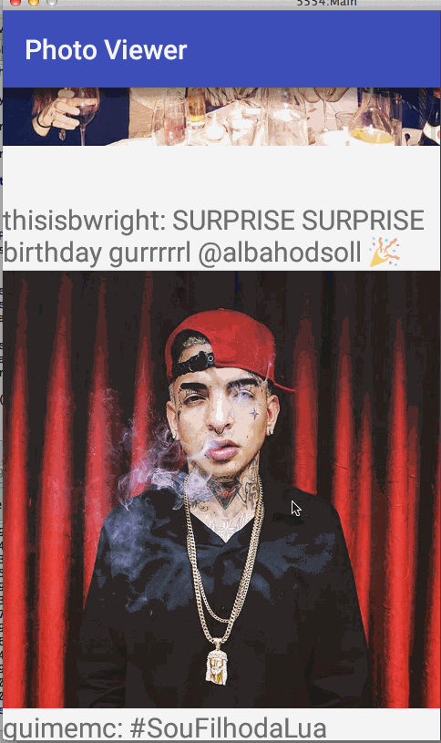

# Homework 1 - *Jeffstagram Photo Viewer*

**Jeffstagram Photo Viewer** is an android app that pulls down a handful of currently popular images from Instagram.

Submitted by: **Jeff Martinez**

Time spent: ~**5** hours spent in total

## User Stories

The following **required** functionality is completed:

* [X] User can scroll through current popular photos from Instagram
* [X] For each photo displayed, user can see the following details:
  * [X] Graphic
  * [X] Caption
  * [X] Username

The following **optional** functionality is completed:

* [ ] Relative timestamp, like count, user profile image are displyed
* [ ] Add pull-to-refresh for popular stream with SwipeRefreshLayout
* [ ] Show latest comment for each photo (bonus: show last 2 comments)
* [ ] Display each user profile image using a RoundedImageView
* [ ] Display a nice default placeholder graphic for each image during loading (read more about Picasso)
* [ ] Improve the user interface through styling and coloring
* [ ] Allow user to view all comments for an image within a separate activity or dialog fragment
* [ ] Allow video posts to be played in full-screen using the VideoView

The following **additional** features are implemented:

* [X] Show a toast notifying the user if images could not be retrieved.
* [X] Toggle expansion of the caption text on tap

## Video Walkthrough

GIFs created with [LiceCap](http://www.cockos.com/licecap/).

## Notes

### Challenges encountered

* The part of the instructional video where it suggests that we use `ImageView.setImageResource(0)` did not work for me, giving a runtime error that resource with id `0` could not be found. After some googling, it seems that the more robust way to accomplish the purpose of that line is to use `[ImageView].setImageResource(android.R.color.transparent)` instead, which is a resource that always exists, yet has the same effect of showing nothing.
* I had trouble getting the click event expansion and collapse to work correctly at first. On my first attempt I cleared the `ellipsize` and `maxlines` of the view and *all* of the captions were set to expand and show the entire contents. Then I found a way to set it on the correct view and stored the `expandedCaption` metadata on the model of my `InstagramPhoto` object. I'm convinced there must be a better way to do this, as that is not really part of the model but rather just part of the view, related to how that model is displayed.
* I was initially using `photoJSON.has("user")` to verify that the "user" key existed, but it seems the correct way to do this is using `!photoJSON.isNull("user")` instead, to make sure it's there and isn't `null` as well. This took me a bit of digging to find the correct method to use.

## License

    The MIT License (MIT)

	Copyright (c) 2015 jeff martinez
	
	Permission is hereby granted, free of charge, to any person obtaining a copy
	of this software and associated documentation files (the "Software"), to deal
	in the Software without restriction, including without limitation the rights
	to use, copy, modify, merge, publish, distribute, sublicense, and/or sell
	copies of the Software, and to permit persons to whom the Software is
	furnished to do so, subject to the following conditions:
	
	The above copyright notice and this permission notice shall be included in all
	copies or substantial portions of the Software.
	
	THE SOFTWARE IS PROVIDED "AS IS", WITHOUT WARRANTY OF ANY KIND, EXPRESS OR
	IMPLIED, INCLUDING BUT NOT LIMITED TO THE WARRANTIES OF MERCHANTABILITY,
	FITNESS FOR A PARTICULAR PURPOSE AND NONINFRINGEMENT. IN NO EVENT SHALL THE
	AUTHORS OR COPYRIGHT HOLDERS BE LIABLE FOR ANY CLAIM, DAMAGES OR OTHER
	LIABILITY, WHETHER IN AN ACTION OF CONTRACT, TORT OR OTHERWISE, ARISING FROM,
	OUT OF OR IN CONNECTION WITH THE SOFTWARE OR THE USE OR OTHER DEALINGS IN THE
	SOFTWARE.